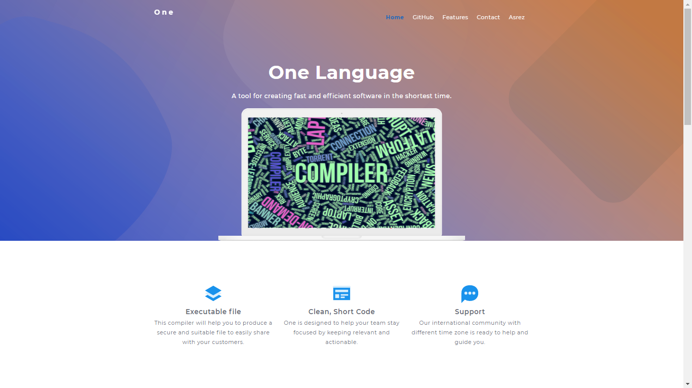

# One Programming Language Website

<!-- ALL-CONTRIBUTORS-BADGE:START - Do not remove or modify this section -->

<!-- ALL-CONTRIBUTORS-BADGE:END -->

## OneLang.org Website

An official repository for the One programming language [website](http://onelang.org/).

## Contributors ✨

Thanks goes to these wonderful people ([emoji key](https://allcontributors.org/docs/en/emoji-key)):

<!-- ALL-CONTRIBUTORS-LIST:START - Do not remove or modify this section -->
<!-- prettier-ignore-start -->
<!-- markdownlint-disable -->
<table>
  <tr>
    <td align="center"><a href="https://maxbase.org/"> <b>Max Base</b></a> <a href="https://github.com/One-Language/Website/commits?author=BaseMax" title="Code">💻</a> <a href="#business-BaseMax" title="Business development">💼</a> <a href="#content-BaseMax" title="Content">🖋</a> <a href="https://github.com/One-Language/Website/commits?author=BaseMax" title="Documentation">📖</a> <a href="#ideas-BaseMax" title="Ideas, Planning, & Feedback">🤔</a> <a href="#maintenance-BaseMax" title="Maintenance">🚧</a> <a href="#mentoring-BaseMax" title="Mentoring">🧑‍🏫</a> <a href="#projectManagement-BaseMax" title="Project Management">📆</a> <a href="#question-BaseMax" title="Answering Questions">💬</a> <a href="https://github.com/One-Language/Website/pulls?q=is%3Apr+reviewed-by%3ABaseMax" title="Reviewed Pull Requests">👀</a></td>
    <td align="center"><a href="https://github.com/jbampton"> <b>John Bampton</b></a> <a href="#projectManagement-jbampton" title="Project Management">📆</a> <a href="#business-jbampton" title="Business development">💼</a> <a href="https://github.com/One-Language/Website/commits?author=jbampton" title="Code">💻</a> <a href="https://github.com/One-Language/Website/commits?author=jbampton" title="Documentation">📖</a> <a href="#eventOrganizing-jbampton" title="Event Organizing">📋</a> <a href="#financial-jbampton" title="Financial">💵</a> <a href="#ideas-jbampton" title="Ideas, Planning, & Feedback">🤔</a> <a href="#infra-jbampton" title="Infrastructure (Hosting, Build-Tools, etc)">🚇</a> <a href="#maintenance-jbampton" title="Maintenance">🚧</a> <a href="#mentoring-jbampton" title="Mentoring">🧑‍🏫</a> <a href="https://github.com/One-Language/Website/pulls?q=is%3Apr+reviewed-by%3Ajbampton" title="Reviewed Pull Requests">👀</a> <a href="https://github.com/One-Language/Website/commits?author=jbampton" title="Tests">⚠️</a></td>
    <td align="center"><a href="https://mattglei.ch"> <b>Matt Gleich</b></a> <a href="https://github.com/One-Language/Website/commits?author=gleich" title="Code">💻</a></td>
    <td align="center"><a href="https://github.com/tHe-AK"> <b>Akshay Kapoor</b></a> <a href="https://github.com/One-Language/Website/commits?author=tHe-AK" title="Documentation">📖</a></td>
    <td align="center"><a href="https://github.com/Cal-Hagner"> <b>Caleb Hagner</b></a> <a href="https://github.com/One-Language/Website/commits?author=Cal-Hagner" title="Documentation">📖</a></td>
    <td align="center"><a href="https://github.com/uzproblue"> <b>Firdavs Rakhmonov</b></a> <a href="https://github.com/One-Language/Website/commits?author=uzproblue" title="Documentation">📖</a></td>
    <td align="center"><a href="https://github.com/async-costelo"> <b>4sync</b></a> <a href="https://github.com/One-Language/Website/commits?author=async-costelo" title="Documentation">📖</a></td>
  </tr>
  <tr>
    <td align="center"><a href="https://allcontributors.org"> <b>All Contributors</b></a> <a href="https://github.com/One-Language/Website/commits?author=all-contributors" title="Documentation">📖</a></td>
    <td align="center"><a href="https://github.com/features/security"> <b>Dependabot</b></a> <a href="#security-dependabot" title="Security">🛡️</a> <a href="#maintenance-dependabot" title="Maintenance">🚧</a></td>
    <td align="center"><a href="https://imgbot.net"> <b>Imgbot</b></a> <a href="#maintenance-ImgBotApp" title="Maintenance">🚧</a></td>
  </tr>
</table>

<!-- markdownlint-restore -->
<!-- prettier-ignore-end -->

<!-- ALL-CONTRIBUTORS-LIST:END -->

This project follows the [all-contributors](https://github.com/all-contributors/all-contributors) specification. Contributions of any kind welcome!
