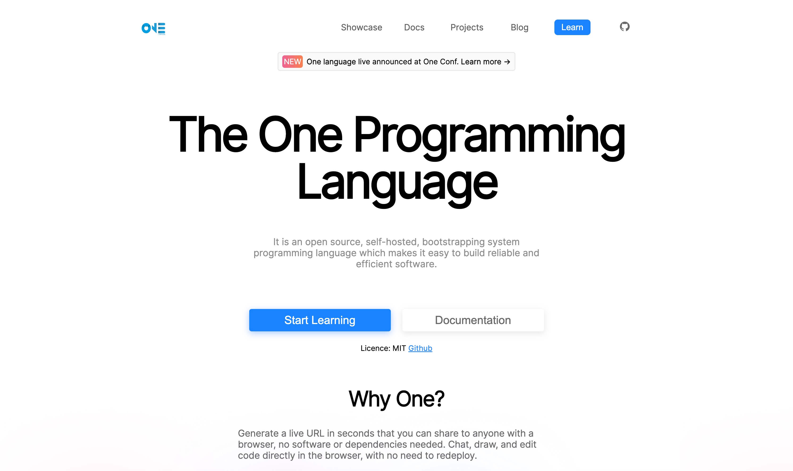

# One Programming Language Website

## OneLang.org Website

An official repository for the One programming language [website](http://onelang.org/).

### SASS

| NodeJS  | Supported node-sass | version Node Module |
|---------|---------------------|---------------------|
| Node 16 | 6.0+                | 93                  |
| Node 15 | 5.0+                | 88                  |
| Node 14 | 4.14+               | 83                  |
| Node 13 | 4.13+, <5.0         | 79                  |
| Node 12 | 4.12+               | 72                  |
| Node 11 | 4.10+, <5.0         | 67                  |
| Node 10 | 4.9+, <6.0          | 64                  |
| Node 8  | 4.5.3+, <5.0        | 57                  |
| Node <8 | <5.0                | <57                 |

## Contributors

Made with [contrib.rocks](https://contrib.rocks).
